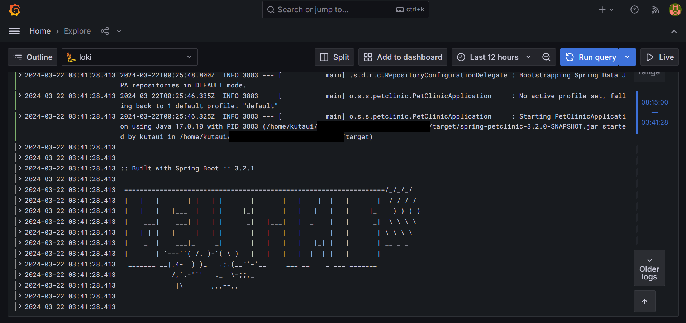

# Grafana Loki & Promtail Logging

Logging a Spring boot application with Grafana Loki & Promtail. Currently can only see the 
output logs and error logs because the project does not have a custom logger (like Logback or 
log4j). The app is running with pm2.

