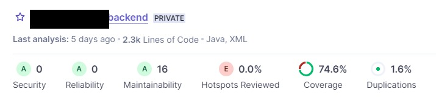
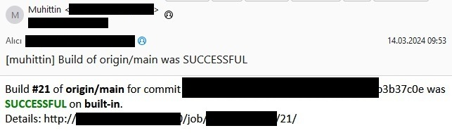
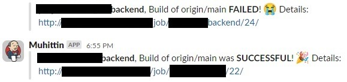

# Jenkins & Sonarqube Pipeline

### This is a pipeline for a Maven project.

The tests need to connect to a database, so I used docker
to create a mysql container and tried to make it dynamic so two consecutive spin ups wouldn't
clash with ports etc. After the tests are run, the Sonarqube scanner is used to scan the project
and the results are published to the Sonarqube server. After everything is finished we send the
results to slack and e-mail accordingly. You can check the pictures below to see the pipeline in
action. 

 

### Sonar Result

### Automated E-mail & Slack Messages

